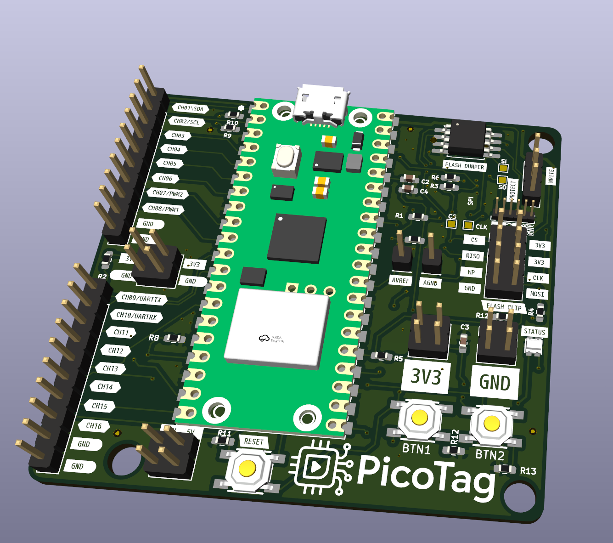

# PicoTag – Hardware Overview

**PicoTag** is a compact hardware reverse engineering and interface discovery board powered by the Raspberry Pi Pico W. It is designed for embedded developers and security researchers who need to scan, probe, and interact with unknown hardware interfaces like JTAG, SWD, SPI, and UART. The board routes 16 GPIOs for flexible digital analysis, integrates a flash dumper interface, and supports a built-in terminal experience via USB.

---

## 🧠 Core Features

- **Powered by Raspberry Pi Pico W (RP2040W)**
  - Dual-core ARM Cortex-M0+
  - USB-CDC console for interacting with the onboard terminal (SpicyTerm)
  - Wi-Fi ready for future remote applications

- **Runs PicoTag Terminal**
  - Interactive command-line terminal over USB serial
  - Extensible command modules (JTAG scan, Flash dump, GPIO monitor, etc.)

- **Supports Analog Inputs (3.3V only)**
  - Safely connect analog signals for measurement and analysis

---

## ⚙️ GPIO Scan Interface

- **16 dedicated GPIO channels** labeled `CH01` to `CH16`
  - Direct 3.3 V logic (no level shifting)
  - Clearly labeled edge connector for easy probing
  - CH01/02 double as I2C (SDA/SCL)
  - CH09/10 double as UART (TX/RX)
  - CH07/08 labeled for PWM

- **All GPIOs referenced to 3.3 V domain**
  - Designed for direct connection to 3.3 V targets
  - Ground and 3.3 V rails provided next to scan header for scope or logic analyzer use

---

## 🔌 Flash Dumper Interface

- **Dedicated SPI flash dump section**
  - Labeled `FLASH DUMPER` with headers for:
    - `CS`, `CLK`, `MISO`, `MOSI`, `WP`, `HOLD`
  - Designed for quick clip-to-dump workflows using SOIC-8 flash clips
  - Jumper-selectable voltage (3.3 V-only)
  - Status LED indicates active operations

---

## 🧠 Control & I/O

- **Two tactile buttons**: `BTN1` and `BTN2`
  - Used for scan triggers, reset functions, or user-defined inputs

- **RESET button** for the Pico W

- **Visuals and labeling**
  - High-quality silkscreen labels for every interface
  - Clean corner mounting holes and rounded PCB edges

---

## 🔋 Power Supply

- **USB-powered (5 V input via Pico W USB)**
- Onboard LDO provides 3.3 V (shared with all logic and headers)
- 3.3 V and GND pins broken out at multiple locations

---
